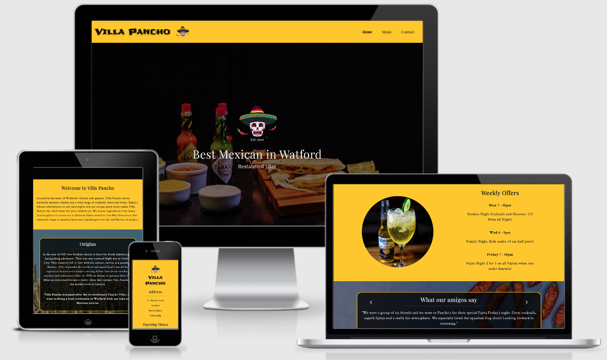

# Villa Pancho - Milestone Project 1

[View the live project here.](https://lukehanson2429.github.io/Villa-Pancho/index.html)

## Project Overview

The Project goal is to create a clear, concise and user friendly website for Villa Pancho, a mexican style bar & restaurant 
in watford. The Client a local entrepeneur would like the site to have a distinctive brand image. The Look of the brand must 
have a professional and credible image and it is hoped that the concept can be rolled out and replicated at other locations.

### Project Goals

* The Website must be fully responsive on all devices.
* To interest the user on what Pancho Villa has to offer.
* Clear design presentation which allows the the user to navigate easily.
* To maximise future maintainability through documentation, code structure and organisation.
* The target users will range from young adults, families and groups for business or private entertaining or functions.

### User Stories 

* As a new user I want to be able to understand the site layout clearly to navigate to my final destination.
* As a new user I want to know more about the restaurant, what they are offering and why I would want to visit.
* As a new user I want to know more about the food and drinks menu to see whether the food/drinks suits my taste and to see the cost.
* As a new user I want to be able to contact the restaurant should i would like to make a reservation.
* As a new user I"m interested in seeing reviews to see other customers thoughts on the restaurant/bar.
* As a new user I want to know if there are any offers on at the moment.

* As an existing user I would like to get in contact to make a reservation.

### Design

1. Colour Scheme
    * Hot Vibrant colours have been chosen for my website to suit the mexican theme with a contrast of black (#000) text on lighter backgrounds and white (#e4e4e4) text  on darker backgrounds to make a visually appealing stand out design. 
    * The colour of #ffc800 (a vibrant hot yellow) has been picked as one of the main colours for the header and footer and parts of the main content on the home page, this helps build a recognisable image for the brand and to go with distinct flavours of mexico.
    * To contrast between the yellows background images with blues have picked to give the appearance of blue skys to suit the hot mexican climate.
    * For Hover functions on Villa Pancho logo, buttons and social icons the colour of #468058 which a dark green similar to the green on the mexican flag. This is coordinates with the green on the Villa Pancho Sombrero logo to all tie in appropriately.
    * Elements of reds are also visible throughout the website on the logo & background images as this colour is closely associated with Chillies/Spicy Food.

2. Typography
    * The font style of Frijole has been chosen for the website brand/logo (Villa Pancho) within the header & footer. This is a fun distinct font which will be easily recognisable and doesn't take itself too seriously. The idea behind this is so its appealing too a wider audience such as families, young adults and work colleagues.
    * The font style of Playfair Display has been chosen for headings for all pages as its a traditional curvy style to give an authentic feel to the website.
    * The font style of Crimson Text has been chosen for paragraph/menu content as its a easy to read with a traditional feel.
    * Descriptions of the each menu item has been written in italic font to provide a professional & traditional feel to each menu item.
    * All Playfair Display & Crimson Text has been given a letter spacing of 0.05em to make it clear and easy to read across all web pages.
    * The fallback fonts across all webpages is sans serif for any reason the main fonts do not import correctly.

3. Imagery
    * The Villa Pancho skull with a sombrero logo is designed within the Headers, footers & centered within the main hero image on the front page to make the brand instantly recognisable along with the Frijole text.
    * The main hero image on the home page is of typical mexican food/ingredients (limes, salsa, sour cream, tobasco, quacemole, etc) This will help identify with the target audience that this website is associated with mexican cuisine. An opaque overlay has also been added to the main hero home image to make the lighter text stand out.
    * On the home page a background image of a cactus is behind the origins & party at Pancho's section as its an important cultural and historical symbol in Mexico. This also has a dark opaque overlay to provide a continuation of style of images for the home page to aid a visual flow and also helps the lightly coloured font within this section stand out.
    * On the home page a background image of a corona/alcoholic beverage has been added to the left of the weekly offers section as a Corona is a instantly recognisable mexican drink. This has been given a rounded radius for a more visually appealing style.
    * On the home page a background image of chillies is behind the testiomonials/reviews section to tie in with the spicy food theme. This also has a dark opaque overlay to provide a continuation of style of images for the home page to aid a visual flow and also helps the lightly coloured font within this section stand out.
    * For the menu page a lightly coloured cactus background image is behind the menu items columns to tie in nicely with the cultural theme on the home page. As the image is lightly cloured the black menu items are easily visible within the slightly transparent yellow columns. The transparent yellow is the same as the rest of web pages (#ffc800).
    * For the menu page a lightly coloured cactus background image is behind the menu items columns to tie in nicely with the cultural theme on the home page. As the image is lightly cloured the black menu items are easily visible within the slightly transparent yellow columns. The transparent yellow is the same as the rest of web pages (#ffc800).
    * For the contact page a background image of red peppers is behind the booking form. This flows appropriately with the other reds thoughout the website. An opaque overlay has also been included to make the booking form and white (#e4e4e4) font easy to read.

### WireFrames

### Features

* Responsive on all devices.
* Interactive elements such as:
    * Dropdown hamburger menu on mobile devices using Bootsrap.
    * Bootstrap Carousel for reviews/testiomonials of the restaurant.
    * Font AwesomevSocial/Interactive Links & Buttons.
    * Bootstrap Booking Form on Contact page.

### Features left to implement

* Gallery page
* Events page

### Languages Used

* [HTML5](https://en.wikipedia.org/wiki/HTML5)
* [CSS3](https://en.wikipedia.org/wiki/CSS)

### Frameworks, Libraries & Programs Used

1. Bootstrap 4.5.2:
    * Bootstrap was used to assist with the responsiveness and styling of the website, especially helpful for Navbar, Carousel & Booking Form.   
2. Hover.css:
    * Hover.css was used on the Social Media icons in the footer, Navbar brand in header, bootstrap button on contact page & font awesome icon on Party at Pancho's section to add the float transition while being hovered over.
3. Google Fonts:
    * Google fonts were used to import the 'Frijole, Playfair Display & Crimson Text' fonts into the style.css file which are used on all pages throughout the project.
4. Font Awesome:
    * Font Awesome was used on all pages throughout the website to add icons for aesthetic and UX purposes.
5. jQuery:
    * jQuery came with Bootstrap to make the navbar responsive but was also used for the smooth scroll function in JavaScript & for the Carousel to be operational.
6. Gitpod:
    * The Interactive Development Envvironment to code the website. Git was used for version control by utilizing the Gitpod terminal to commit to Git and Push to GitHub.
7. GitHub:
    * GitHub is used to store the projects code after being pushed from Git.
8. Figma:
    * This was used to create my wireframe designs for desktop/mobile formats.
9. Chrome Dev tools:
    * To assist with debugging code, especially helpful for working out appropriate padding, margins etc.

### Testing

The W3C Markup Validator and W3C CSS Validator Services were used to validate every page of the project to ensure there were no syntax errors in the project.

* [W3C Markup Validator](https://validator.w3.org/#validate_by_input)
* [W3C CSS Validator](https://jigsaw.w3.org/css-validator/#validate_by_input)

